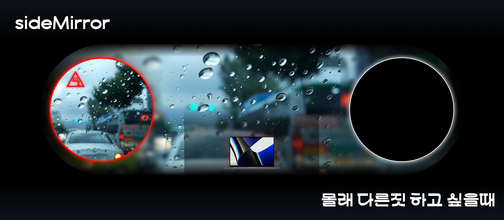

# side-mirror



몰래 다른 짓을 하다가 뒤에서 누가 쳐다본다면 확실히 불편하고 걸리면 안되는 일이 분명히 존재합니다.
그러한 것을 해결하기 위한 맥 용 서비스 입니다.

나 말고 다른사람이 쳐다볼때 맥이 알아서 크롬이나 메일 화면으로 자동으로 전환해주죠.
이제 안심하고 딴짓하셔도 됩니다.

## 사전 요구사항

- macOS 13 (Ventura) 이상
- Xcode Command Line Tools (`xcode-select --install`)

## 빌드 & 실행

```sh
chmod +x Scripts/build_app.sh
./Scripts/build_app.sh
open dist/SideMirror.app
```

처음 실행 시 아래 두 가지 권한을 허용해야 정상 동작합니다.

- **카메라 권한** — 사람 감지에 사용
- **손쉬운 사용(Accessibility) 권한** — 바탕화면 전환에 사용 (시스템 설정 → 개인 정보 보호 및 보안 → 손쉬운 사용)

## 사용법

실행하면 상단 메뉴 막대에 카메라 아이콘이 나타납니다.

| 상태 | 조건 | 동작 |
|------|------|------|
| **Safe** | 나 혼자 감지 | 아무것도 안 함 |
| **Warning** | 2명 이상 감지 3초 지속 | 화면 가장자리에 경고 표시 |
| **Privacy Mode** | 경고 후 2초 추가 지속 | macOS 바탕화면으로 자동 전환 |

### 메뉴 막대 아이콘 클릭 시

- **일시정지 / 다시시작** — 감지를 멈추거나 재개
- **설정** — Warning/Privacy 진입 타이머 조절
- **종료** — 앱 종료
